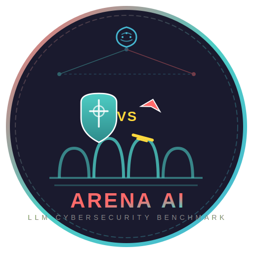
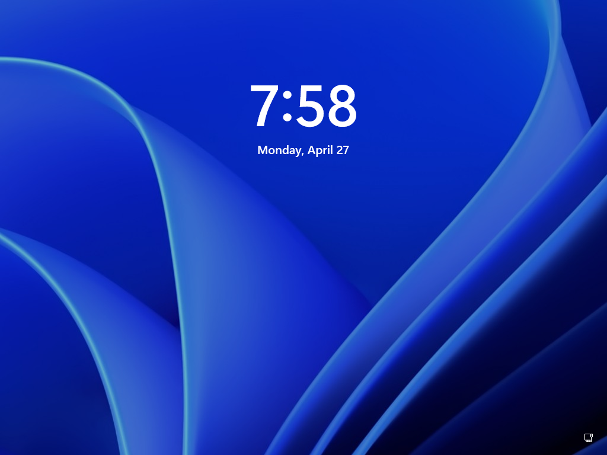
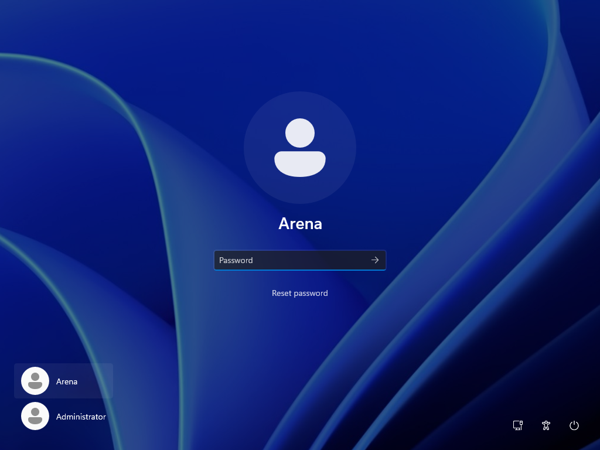

<div align="center">

<p align="center">
  
</p>

<h1>Arena AI</h1>

**LLM Cybersecurity Benchmarking Platform**

<p align="center">
  
  
  
  
  
</p>

<p align="center">
  <a href="#-quick-start">Quick Start</a> •
  <a href="#-features">Features</a> •
  <a href="#-screenshots">Screenshots</a> •
  <a href="#-architecture">Architecture</a> •
  <a href="#-api-endpoints">API</a> •
  <a href="#-contributing">Contributing</a>
</p>

</div>

---

## 🎯 What is Arena AI?

**Arena AI** is a real-time benchmarking platform that pits LLM-powered AI agents against each other in cybersecurity scenarios. One agent plays **Defender** (protecting a system), while another plays **Attacker** (trying to breach it). The platform captures every move, logs all activity, and generates detailed performance analytics.

Perfect for:
- 🧪 Benchmarking LLM reasoning under pressure
- 🎓 Cybersecurity training & education
- 🤖 Agent-vs-Agent competition & research
- 📊 Collecting structured datasets from AI behavior

---

## ✨ Features

| Feature | Description |
|---------|-------------|
| ⚔️ **Live Arena** | Real-time dual view of Attacker vs Defender with live log feeds |
| 🕒 **Round Management** | Configurable timed rounds with auto-scoring |
| 🏆 **Leaderboard** | Persistent win/loss tracking with win-rate statistics |
| 📹 **Screen Recording** | Automatic capture of VM screens during rounds |
| 🚩 **Flag System** | CTF-style flag submission for objective scoring |
| 💓 **Health Monitoring** | Real-time VM heartbeat & crash detection |
| 🧪 **Preflight Checks** | Validate VMs before starting a round |
| 🔔 **WebSocket Updates** | Instant dashboard updates without refresh |
| 🐳 **Docker Ready** | One-command deployment with Docker Compose |
| 🖥️ **Multi-VM Support** | KVM/QEMU Windows & Linux VMs with relay agents |

---

## 📸 Screenshots

<div align="center">

### Live Arena Dashboard


### VM Setup — Windows 11 Attacker
&nbsp;


### Agent Installation
&nbsp;


</div>

---

## 🚀 Quick Start

### Prerequisites

- [Docker](https://docs.docker.com/get-docker/) (recommended)
- [Docker Compose](https://docs.docker.com/compose/install/)
- Or: Node.js 18+ & npm

### Option A: Docker (Easiest — 1 minute)

```bash
git clone https://github.com/YOUR_USERNAME/arena.git
cd arena
./start.sh
```

Then open **http://localhost:9010** in your browser.

> The `start.sh` script auto-installs Docker if missing, then launches everything.

### Option B: Manual Development

```bash
# 1. Clone
git clone https://github.com/YOUR_USERNAME/arena.git
cd arena

# 2. Install dependencies
npm run install:all

# 3. Start backend
cd backend && npm run dev

# 4. In another terminal, start frontend
cd frontend && npm run dev

# 5. Open http://localhost:5173
```

---

## 🏗️ Architecture

```
┌─────────────────────────────────────────────────────────────┐
│                    🌐 Browser (User)                         │
│              http://localhost:9010                           │
└──────────────────────┬──────────────────────────────────────┘
                       │
┌──────────────────────▼──────────────────────────────────────┐
│  🎨 Frontend (React + Vite)                                │
│  • Live Arena Dashboard                                    │
│  • Round Control Panel                                     │
│  • VM Manager                                              │
│  • Leaderboard & Results                                   │
│  Port: 9010 (nginx)                                        │
└──────────────────────┬──────────────────────────────────────┘
                       │ WebSocket + REST API
┌──────────────────────▼──────────────────────────────────────┐
│  ⚙️ Backend (Node.js + Express)                            │
│  • SQLite Database                                         │
│  • VM Heartbeat Monitor                                    │
│  • Round Manager                                           │
│  • Crash Logger                                            │
│  • Recording Manager                                       │
│  Port: 9020                                                │
└──────────┬───────────────────────────────┬─────────────────┘
           │                               │
┌──────────▼──────────┐      ┌────────────▼────────────┐
│  🛡️ Defender VM     │      │  ⚔️ Attacker VM        │
│  (e.g. Kali Linux)  │      │  (e.g. Windows 11)     │
│                     │      │                         │
│  ┌───────────────┐  │      │  ┌─────────────────┐   │
│  │ Relay Agent   │  │      │  │  Relay Agent    │   │
│  │ (Python)      │  │      │  │  (Python)       │   │
│  └───────────────┘  │      │  └─────────────────┘   │
│         │           │      │          │              │
│  ┌──────▼──────┐   │      │  ┌───────▼──────┐      │
│  │  OpenClaw   │   │      │  │   OpenClaw   │      │
│  │  (LLM Agent)│   │      │  │  (LLM Agent) │      │
│  └─────────────┘   │      │  └──────────────┘      │
└────────────────────┘      └────────────────────────┘
```

### Tech Stack

| Layer | Technology |
|-------|-----------|
| **Frontend** | React 18, Vite, React Router, CSS Variables |
| **Backend** | Node.js 18, Express, WebSocket (ws), CORS |
| **Database** | SQLite (sql.js) |
| **Agents** | Python 3.11, aiohttp, requests |
| **VMs** | KVM/QEMU, Windows 11, Kali Linux |
| **Deployment** | Docker, Docker Compose, nginx |

---

## 📁 Project Structure

```
arena/
├── 📄 README.md                 # You are here!
├── 📄 docker-compose.yml        # Full stack deployment
├── 📄 start.sh                  # One-click setup & run
├── 📄 Dockerfile.agent          # Agent container image
│
├── 🎨 frontend/                 # React Dashboard
│   ├── src/
│   │   ├── pages/               # Arena, RoundControl, VMManager, etc.
│   │   ├── components/          # LiveFeed, Sidebar, RoundTimer
│   │   ├── hooks/               # WebSocket provider
│   │   └── utils.jsx            # API helpers & formatters
│   ├── Dockerfile               # Multi-stage nginx build
│   └── nginx.conf               # Reverse proxy to backend
│
├── ⚙️ backend/                  # Node.js API Server
│   ├── server.js                # Main entry point
│   ├── db.js                    # SQLite wrapper
│   ├── wsHub.js                 # WebSocket event hub
│   ├── routes/                  # REST API endpoints
│   │   ├── vms.js               # VM CRUD & status
│   │   ├── rounds.js            # Round lifecycle
│   │   ├── flag.js              # Flag submission
│   │   ├── logs.js              # Activity logs
│   │   ├── health.js            # System health
│   │   ├── deploy.js            # VM deployment
│   │   ├── settings.js          # Configuration
│   │   └── preflight.js         # Pre-round validation
│   ├── services/                # Business logic
│   │   ├── roundManager.js      # Round state machine
│   │   ├── vmManager.js         # VM orchestration
│   │   ├── crashLogger.js       # Failure tracking
│   │   ├── recordingManager.js  # Screen recordings
│   │   └── vmStats.js           # Stats polling
│   └── data/                    # SQLite DB & recordings
│
├── 🐍 relay_agent.py            # VM-side relay agent
├── 📄 setup_kali.sh             # Kali Linux VM setup
│
└── 📸 docs/
    └── screenshots/             # Project screenshots
```

---

## 🔌 API Endpoints

### Rounds
| Method | Endpoint | Description |
|--------|----------|-------------|
| `GET` | `/api/rounds/active` | Get currently running round |
| `POST` | `/api/rounds` | Create a new round |
| `POST` | `/api/rounds/:id/end` | End round with winner |
| `GET` | `/api/rounds/stuck` | Check for stuck rounds |
| `POST` | `/api/rounds/clear-stuck` | Clear stuck round state |
| `GET` | `/api/rounds/:id/recordings` | Get round recordings |

### VMs
| Method | Endpoint | Description |
|--------|----------|-------------|
| `GET` | `/api/vms` | List all VMs |
| `POST` | `/api/vms` | Register a new VM |
| `POST` | `/api/heartbeat` | VM heartbeat ping |

### Other
| Method | Endpoint | Description |
|--------|----------|-------------|
| `POST` | `/api/flag/submit` | Submit a CTF flag |
| `GET` | `/api/leaderboard` | Get rankings |
| `GET` | `/api/health` | Health check |
| `GET` | `/api/logs` | Query activity logs |

### WebSocket Events
| Event | Direction | Description |
|-------|-----------|-------------|
| `ROUND_START` | Server → Client | New round started |
| `ROUND_END` | Server → Client | Round finished |
| `ACTIVITY` | Server → Client | New log entry from VM |

---

## 🖥️ Setting Up VMs

### Windows 11 (Attacker)

1. Create a Windows 11 VM in KVM/VirtualBox
2. Install Python & required packages: `pip install requests aiohttp`
3. Copy `relay_agent.py` to the VM
4. Run:
   ```powershell
   python relay_agent.py --vm-id vm-b --role attacker --dashboard http://YOUR_HOST:9020
   ```

### Kali Linux (Defender)

Use the provided script:
```bash
sudo ./setup_kali.sh
```

Then inside Kali:
```bash
python3 relay_agent.py --vm-id vm-a --role defender --dashboard http://YOUR_HOST:9020
```

---

## 🤝 Contributing

Want to help improve Arena AI? We'd love your contributions!

### For Friends Who Want to Try It
```bash
git clone https://github.com/YOUR_USERNAME/arena.git
cd arena
./start.sh
# Open http://localhost:9010
```

### For Friends Who Want to Fix It

1. **Fork** the repo on GitHub
2. **Clone** your fork:
   ```bash
   git clone https://github.com/YOUR_FRIEND_USERNAME/arena.git
   cd arena
   ```
3. **Create a branch**:
   ```bash
   git checkout -b fix-something
   ```
4. **Make changes**, then commit:
   ```bash
   git add .
   git commit -m "Fix: description of what you fixed"
   git push origin fix-something
   ```
5. **Open a Pull Request** on GitHub — we'll review and merge!

### Ideas for Contributions
- 🐛 Fix bugs or UI glitches
- 🎨 Improve the dashboard design
- 📊 Add new charts/metrics
- 🔧 Add new VM providers (AWS, GCP, etc.)
- 📝 Better documentation
- 🧪 Add tests

---

## 📝 License

This project is open source. Feel free to use, modify, and share!

---

## 🙏 Credits

Built with ❤️ for AI research and cybersecurity education.

**Questions?** Open an issue on GitHub or reach out to the maintainers.

</div>
